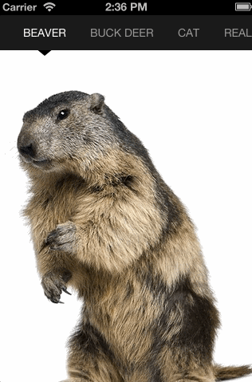

DAPagesContainer
==============

A generic views container with a scrollable top bar
--------------

Just pass the array of view controllers and DAPagesContainer will grab their titles and nicely display them in the top bar (these titles can be different length and do not need to fit the screen width).

Features
==============

- Both content scroll view and top bar can be used for navigation
- If the selected view  is not the "nearest" neighbor of the current one, all the views in between will be skipped to provide a nice smooth animation
- Supports user interface orientation rotations
- Buttons in the top bar change their color as corresponding views become visible

Installation
==============
 
Just drag and drop DAPagesContainer folder into your project.

Usage
==============

Getting started with DAPagesContainer is really simple. Just alloc-init it and assign an array of view controllers. This can be done in the following way:

    self.pagesContainer = [[DAPagesContainer alloc] init];
    [self.pagesContainer willMoveToParentViewController:self];
    self.pagesContainer.view.frame = self.view.bounds;
    self.pagesContainer.view.autoresizingMask = UIViewAutoresizingFlexibleWidth | UIViewAutoresizingFlexibleHeight;
    [self.view addSubview:self.pagesContainer.view];
    [self.pagesContainer didMoveToParentViewController:self];
    self.pagesContainer.viewControllers = @[....];

Customization
==============

Go ahead and experiment with these properties:

    @property (assign, nonatomic) NSUInteger topBarHeight;
    @property (assign, nonatomic) CGSize pageIndicatorViewSize;
    @property (strong, nonatomic) UIColor *topBarBackgroundColor;
    @property (strong, nonatomic) UIFont *topBarItemLabelsFont;
    @property (strong, nonatomic) UIColor *pageItemsTitleColor;
    @property (strong, nonatomic) UIColor *selectedPageItemColor;